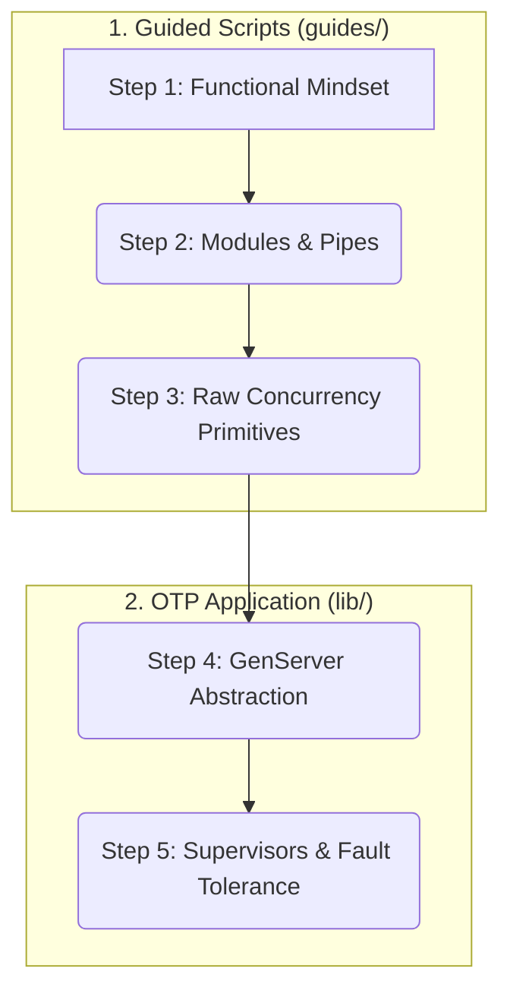

# Elixir & OTP Foundations: A Guided Learning Project

Welcome! This project is a hands-on guide designed to teach you the fundamentals of the Elixir programming language and its powerful OTP concurrency model. You will progress from basic syntax to building a fault-tolerant, concurrent application, one step at a time.

The learning path is structured to turn common points of confusion into "aha!" moments, following the exact plan laid out in the technical specification.

## Learning Path

You will work through a series of guided scripts and then implement a small but powerful OTP application. The final architecture will be a supervised, in-memory Key-Value store.

## How to Use This Repository

1.  **Clone the repository:** `git clone https://github.com/aastom/elixir-otp-foundations.git`
2.  **Install dependencies:** `cd elixir-otp-foundations && mix deps.get`
3.  **Follow the guides:** Start with the `.exs` scripts in the `guides/` directory, in numerical order. These are runnable scripts designed to be read, understood, and executed with `elixir <filename>.exs`.
4.  **Read the Concepts Doc:** The `guides/CONCEPTS.md` file contains crucial explanations that will save you from common pitfalls. Refer to it often.
5.  **Build the Application:** Once you've completed the guides, move on to the `lib/` directory and implement the `KVStore` GenServer and `Supervisor`.
6.  **Run the tests:** You can run `mix test` to check your implementation of the `KVStore`.

---

## Step 1: The Functional Mindset Shift

**Objective:** Internalize immutability and the declarative nature of pattern matching.

*   **Action:** Open `guides/01_basics_and_immutability.exs`. Read the comments and run the script.
*   **Key Concepts:** Basic types, immutability, pattern matching, function clauses.

## Step 2: Composing with Modules and Pipes

**Objective:** Learn to structure code and build readable, functional pipelines.

*   **Action:** Open `guides/02_modules_and_pipes.exs`.
*   **Key Concepts:** Modules (`defmodule`), and the pipe operator (`|>`).

## Step 3: Understanding the Actor Model Primitives

**Objective:** Demystify concurrency by interacting with the raw building blocks.

*   **Action:** Open `guides/03_raw_concurrency.exs`.
*   **Key Concepts:** `spawn`, `send`, `receive`, PIDs, and process mailboxes.

## Step 4: Graduating to the GenServer Abstraction

**Objective:** Understand `GenServer` as a standardized, robust behaviour built on top of the primitives from Step 3.

*   **Action:** Navigate to `lib/elixir_otp_foundations/kv_store.ex` and fill in the implementation.
*   **Key Concepts:** Client API vs. Server Callbacks, `GenServer.call`, `GenServer.cast`, state management.

## Step 5: Demonstrating Fragility and Introducing Supervisors

**Objective:** Experience the "ephemeral state trap" in a controlled manner and understand the role of a Supervisor.

*   **Action:** Implement the `ElixirOtpFoundations.Supervisor` in `lib/elixir_otp_foundations/supervisor.ex` and add it to `lib/elixir_otp_foundations/application.ex`.
*   **Key Concepts:** Process linking, supervisor strategies (`:one_for_one`), and the application lifecycle.
