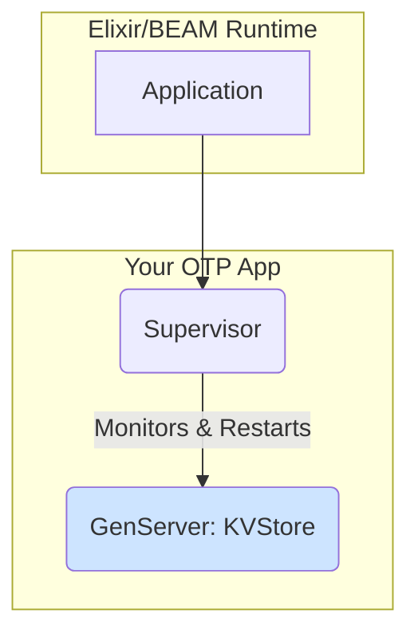

# Application Architecture

This document outlines the final architecture of the OTP application you will build in this project. It follows a standard, minimal OTP structure.

## The Supervision Tree

The structure is a simple, three-level tree:

1.  **Application**: The top-level entry point that the Elixir runtime manages. Its only job is to start and stop the main Supervisor.
2.  **Supervisor**: A process whose only job is to monitor its children. If a child process crashes, the Supervisor will restart it according to a defined strategy.
3.  **GenServer (Worker)**: The process that does the actual work. In our case, it's the `KVStore` process that holds the in-memory state.

This separation of concerns is fundamental to OTP's fault-tolerance guarantees.

### Lifecycle

1.  `mix run --no-halt` starts the application.
2.  The Elixir runtime starts our `ElixirOtpFoundations.Application` module.
3.  The `Application` module's `start/2` function is called, and it starts the `ElixirOtpFoundations.Supervisor`.
4.  The `Supervisor`'s `init/1` function is called. It starts all its children, in this case, the `ElixirOtpFoundations.KVStore` worker.
5.  The `KVStore` `GenServer` is now running and waiting for messages.

If you were to manually kill the `KVStore` process, the `Supervisor` would immediately detect this and restart it, demonstrating fault tolerance.
